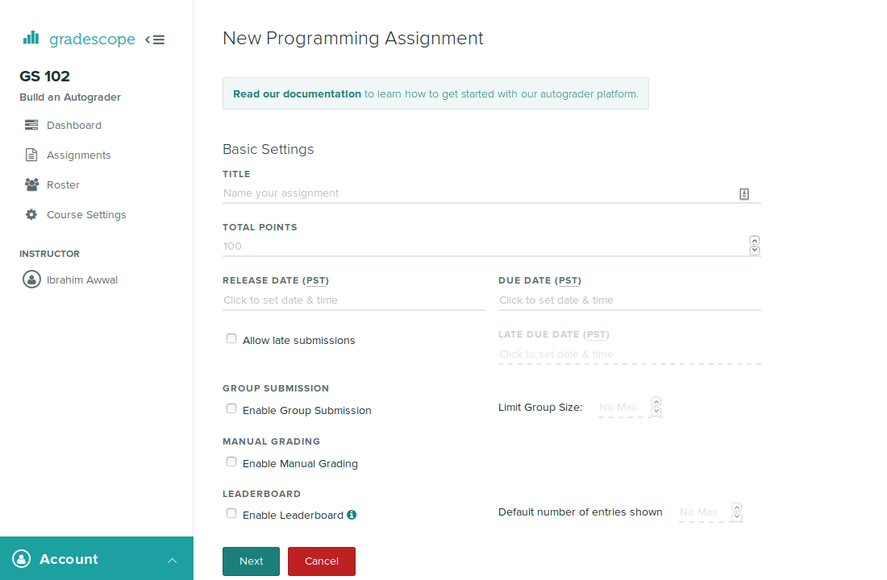
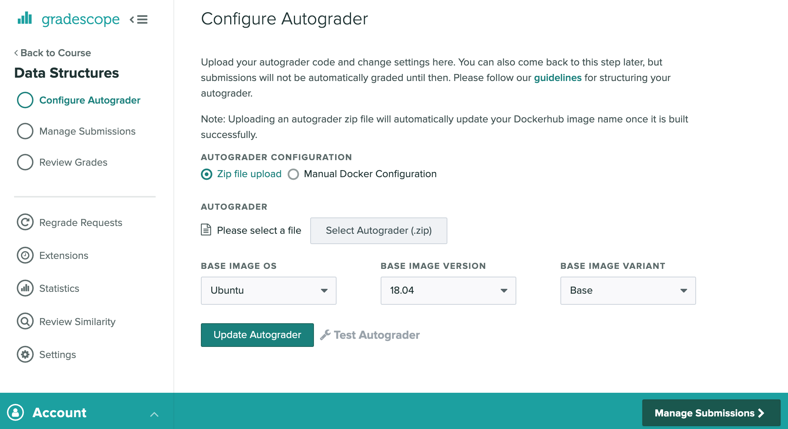
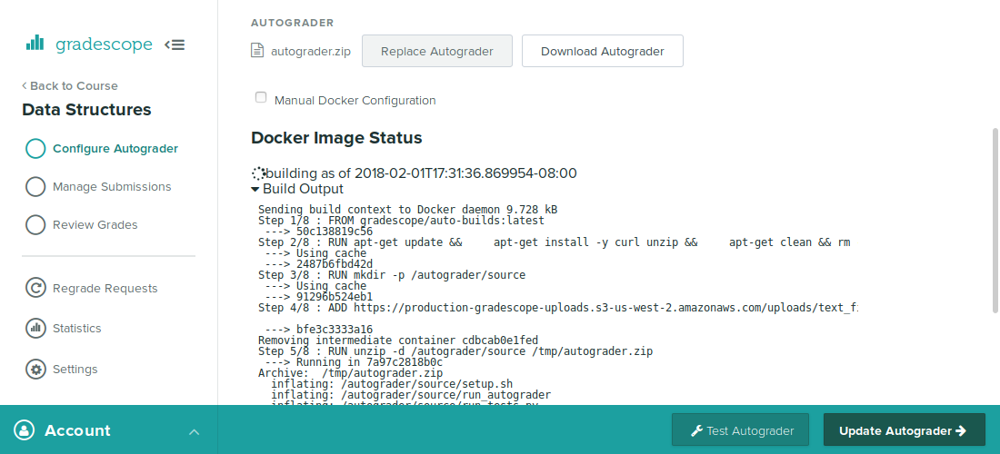
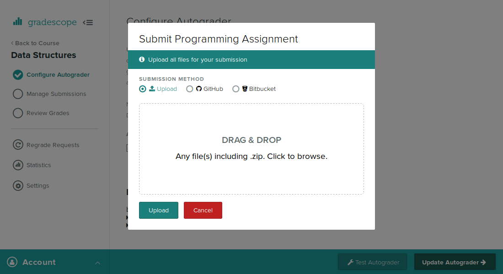
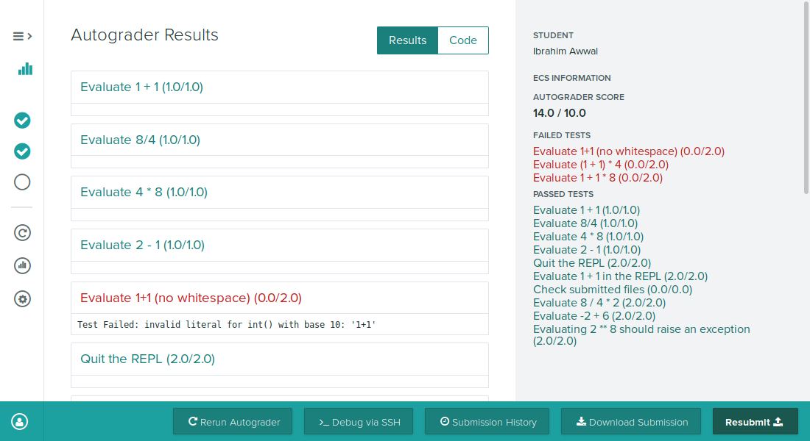

# Getting Started

## Video Walkthrough

If you'd like to watch a video walkthrough of the programming assignment and
code autograder setup process, please see our
[Gradescope for Programming Assignments webinar](https://www.youtube.com/watch?v=ZX3G5dFRZKI){:target="_blank" rel="noopener"}.

## Pre-requisites

If you haven't made an account on Gradescope, sign up as an instructor at
[Gradescope.com](https://gradescope.com/).

Programming assignments are part of [Gradescope Complete](https://info.gradescope.com/pricing),
so you'll need to either upgrade your course, or request trial access to the feature by
emailing [help@gradescope.com](mailto:help@gradescope.com).

You'll need to have a course set up, so create one if you don't have one.

## Setting Up Your Assignment

Navigate to the assignments tab on your course, and click on "Create
Programming Assignment" in the bottom bar.

You'll be asked for some basic details about your assignment. Choose
the appropriate options and continue.

Next you'll be asked to upload your autograder. Upload a zip file
meeting the required [specifications](../specs), select the [base image](../base_images)
you would like to build the autograder with, and press "Update Autograder."

The page will reload and show you the Docker build output
as it sets up your image.

Once the Docker image finishes building, you can click "Test
Autograder" to submit to the autograder yourself. You can use this to
debug the output of your autograder, and make sure everything is set
up correctly. You'll want to make sure your autograder is stable
before allowing students to submit.

Once the release date arrives, students will be allowed to submit
their homework. They'll receive feedback as soon as the autograder
finishes running. You can control what feedback they receive in the
output file format. They'll see a list of test cases that they've
passed and failed, and any output you provide.

Note that the autograder is run automatically only on new submissions. If
you update the autograder for the assignment and want to run the new
autograder on an existing submission, or if you'd like
to rerun the autograder on a submission, you can do so manually by
clicking on "Rerun Autograder".

You can rerun the autograder for all submissions by clicking on "Regrade
All Submissions" on the Manage Submissions page.
